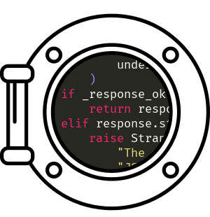

<p align=center>
    
</p>

<h1 align=center>Porthole Python Client</h1>

<p align=center>Python client for Emacs RPC servers started with <a href="https://github.com/jcaw/porthole">Porthole</a>.</p>

<p align=center>
 :sailboat:
</p>

---

<!-- ## What is this Package? -->

[Porthole](https://github.com/jcaw/porthole) lets you start RPC servers in
Emacs. These servers allow Elisp to be invoked remotely via HTTP requests.

This is a client written in Python that makes it easier to communicate with
Porthole. Here's how you'd make a simple call (let's ignore error handling, for
now):

```python
result = emacs_porthole.call(server="my-server", method="insert", params=["Some text to insert."])
```

The text will be inserted into Emacs, and the result of the operation returned.
See [Basic Usage](#basic-usage) for more.

---

## Installation

Install it from PyPI.

`pip install -U emacs_porthole`

## Basic Usage

This client is designed to make it very easy to build RPC tools on top of Emacs. You can write Python scripts to interface with your personal Emacs instance, or build a larger package on the framework.

Let's start a server in Emacs with [Porthole](https://github.com/jcaw/porthole):

```emacs-lisp
;; All you need is a name. Everything else is automatic.
(porthole-start-server "pyrate-server")
;; You need to tell the server which functions are allowed to be called remotely. We'll expose the `insert` function.
(porthole-expose-function "pyrate-server" 'insert)
```

You can now send messages with the client.

```python
from emacs_porthole import call

result = call("pyrate-server", method="insert", params=["Some text to insert"])
```

## Error Handling

Networking isn't foolproof. `emacs_porthole` raises errors to signal problems. Here's a complete example, with error handling:

```python
from emacs_porthole import (
    call,
    PortholeConnectionError,
    MethodNotExposedError,
    InternalMethodError,
    TimeoutError
)

def sum_in_emacs():
    try:
        return call("pyrate-server", method="+", params=[1, 2, 3])
    except TimeoutError:
        print("The request timed out. Is Emacs busy?")
    except PortholeConnectionError:
        print("There was a problem connecting to the server. Is it running?")
    except MethodNotExposedError:
        print("The method wasn't exposed! Remember to expose it in the porthole server.")
    except InternalMethodError as e:
        # This will be raised when the function was executed, and raised an error during execution.
        print("There was an error executing the method. Details:\n"
              "error_type: {}\n".format(e.elisp_error_symbol)
              "error_data: {}".format(e.elisp_error_data))
```

Errors are split into connection errors, and problems with the RPC request.
These are the main errors you may want to catch:

### Connection Errors

These errors are raised when `emacs_porthole` can't connect.

- `ServerNotRunningError` - This error means the server isn't running.

  This error will be raised if there's an error connecting to the Porthole
  server *other* than a timeout. If the server is dead, or an HTTP response
  other that `200: Success` is returned, this will be raised.

- `TimeoutError` - This error will be raised when the request times out. This
  *normally* means the server is running, but the Emacs session is busy.

- `PortholeConnectionError` - This is the superclass for both
  `ServerNotRunningError` and `TimeoutError`. You can use this error to catch
  all connection issues.

More specific errors exist, which are subclasses of these errors.

### RPC-Related Errors

These errors are raised when a connection was made, but there was a problem with
the underlying RPC call. There are 5 of these errors, but you should only
encounter two:

- `InternalMethodError` - This will be raised if Emacs tried to execute your
  function, but it raised an error. This is the RPC error you're most likely to
  encounter. The underlying Elisp error will be attached to this exception in
  the following members:
  - `.elisp_error_type` - This holds the type of error that was raised. It will
    be a string, representing the error's symbol.
  - `.elisp_error_data` - Additional data about the error. Elisp errors are
    `cons` cells, composed of an error symbol (the type) and a `cdr` list
    containing the data. This member will be the data list, translated into
    Python.

    Note that it's possible for Emacs to raise an error that can't be encoded
    into JSON. In that case, some data will be replaced by a string placeholder,
    explaining the problem. In practice, you are unlikely to encounter this.

- `MethodNotExposedError` - This will be raised if you try to call a function
  that isn't exposed, or doesn't exist. It means the Porthole server has not
  allowed execution of your desired function.

If you see one of the other `json_rpc` errors, something went wrong. Please [open an
issue](http://github.com/jcaw/porthole-python-client/issues).

Note that these errors are only raised by the `call` method. See the next
section for details.

## Raw JSON-RPC Objects

If you like, you can circumvent the the `call` method and get the raw JSON-RPC
2.0 response directly. Use the `call_raw` method.

```python
json_response_dict = call_raw(server_name, method, params)
```

This will return a JSON-RPC 2.0 response dictionary when successful. The dictionary will have the following structure:

```python
# For a successful result
{
    "jsonrpc": "2.0",
    "result": 6,
    "id": ...
}

# For an error
{
    "jsonrpc": "2.0",
    "error": {
         "code": -32603,
         "message": "There was an error calling the method.",
         # The "data" member will be None, unless there is data, then it will be a dict.
         "data": {
             # There is not always an underlying error. This member will only exist when there is.
             "underlying-error": {
                 "type": "wrong-type-argument",
                 "data": ["stringp" 1],
             }
         }
    },
    "id": ...
}
```

With error handling, then:

```python
import emacs_porthole

def sum_in_emacs_raw():
   # You still need to catch connection errors
   try:
        return call_raw("pyrate-server", method="+", [1, 2, 3])
    except TimeoutError:
        print("The request timed out. Is Emacs busy?")
    except PortholeConnectionError:
        print("There was a problem connecting to the server. Is it running?")

```

You'll need to parse the JSON-RPC response object yourself.


## TODO

- Batch Requests
